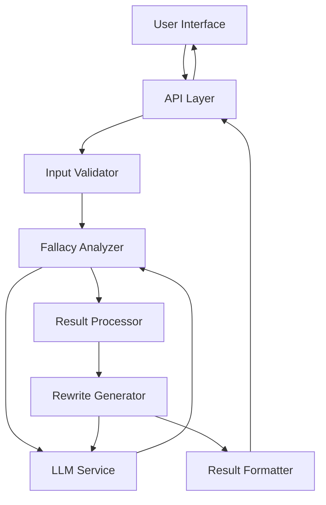
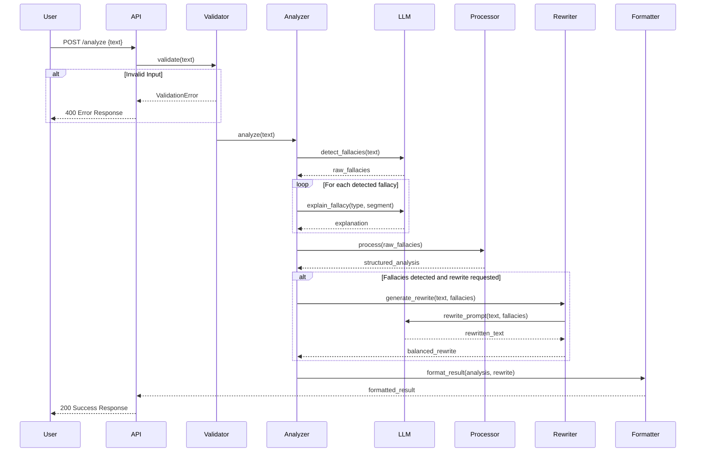

# Design Document: SatyaSetu

## Overview

SatyaSetu is a lightweight digital reasoning literacy tool that detects logical fallacies in English text using transformer-based language models. The system provides educational explanations, confidence scores, and balanced rewrites to help users improve their critical thinking skills.

The design prioritizes simplicity, educational value, and rapid deployment within a 15-day timeline. The architecture uses a modular approach with clear separation between input validation, LLM-based analysis, result processing, and presentation layers.

## Architecture

### High-Level Architecture



### Component Architecture

The system follows a pipeline architecture with these core components:

1. **API Layer**: REST API endpoint that receives text input and returns analysis results
2. **Input Validator**: Validates text length, language, and format requirements
3. **Fallacy Analyzer**: Orchestrates LLM calls to detect fallacies and generate explanations
4. **LLM Service**: Wrapper around transformer-based model for semantic analysis
5. **Result Processor**: Structures detected fallacies with confidence scores and locations
6. **Rewrite Generator**: Creates balanced rewrites using LLM with fallacy corrections
7. **Result Formatter**: Formats final output for presentation

### Design Principles

- **Modularity**: Each component has a single responsibility
- **Testability**: Components can be tested independently with mock LLM responses
- **Simplicity**: Minimal dependencies, straightforward data flow
- **Educational Focus**: All outputs prioritize learning and understanding

## Technology Stack

### Core Technologies

**Programming Language**: Python 3.10+
- Rationale: Rich ecosystem for NLP, rapid development, excellent LLM library support

**LLM Framework**: Hugging Face Transformers
- Rationale: Industry standard, extensive model selection, good documentation
- Model: FLAN-T5-base or similar instruction-tuned model (220M parameters)
- Alternative: GPT-2 medium for fully local deployment

**Web Framework**: FastAPI
- Rationale: Modern async support, automatic API documentation, type hints
- Provides built-in validation with Pydantic models

**Testing**: pytest + Hypothesis
- pytest: Standard Python testing framework
- Hypothesis: Property-based testing library for comprehensive test coverage

### Infrastructure

**Deployment**: Docker container
- Single container deployment for simplicity
- Easy local development and cloud deployment

**Cloud Platform** (Optional): AWS Lambda + API Gateway or Google Cloud Run
- Serverless for cost optimization
- Auto-scaling for variable load

**Storage**: None required for prototype
- Stateless design, no persistence needed
- Future: Add database for usage analytics

### Dependencies

Minimal dependency approach:
```
fastapi==0.104.0
uvicorn==0.24.0
transformers==4.35.0
torch==2.1.0
pydantic==2.5.0
pytest==7.4.3
hypothesis==6.92.0
```

## API Design

### Endpoint: Analyze Text

**POST /api/v1/analyze**

Request:
```json
{
  "text": "string (10-5000 characters)",
  "options": {
    "include_rewrite": "boolean (default: true)",
    "min_confidence": "integer (0-100, default: 0)"
  }
}
```

Response (Success):
```json
{
  "status": "success",
  "input_text": "original text",
  "analysis": {
    "fallacies_detected": [
      {
        "type": "ad_hominem",
        "location": {
          "start": 45,
          "end": 89,
          "text": "excerpt from input"
        },
        "confidence": 85,
        "confidence_level": "high",
        "explanation": {
          "definition": "An ad hominem fallacy...",
          "why_this_is_fallacy": "This text attacks the person...",
          "educational_note": "To avoid this fallacy..."
        }
      }
    ],
    "summary": {
      "total_fallacies": 2,
      "by_type": {
        "ad_hominem": 1,
        "straw_man": 1
      },
      "average_confidence": 78.5
    }
  },
  "balanced_rewrite": {
    "text": "rewritten text",
    "changes": [
      {
        "original": "text segment",
        "revised": "corrected segment",
        "reason": "Removed ad hominem attack"
      }
    ]
  },
  "processing_time_ms": 3421
}
```

Response (No Fallacies):
```json
{
  "status": "success",
  "input_text": "original text",
  "analysis": {
    "fallacies_detected": [],
    "summary": {
      "total_fallacies": 0,
      "message": "No logical fallacies detected. The reasoning appears sound."
    }
  },
  "balanced_rewrite": null,
  "processing_time_ms": 2156
}
```

Response (Error):
```json
{
  "status": "error",
  "error": {
    "code": "INVALID_INPUT",
    "message": "Text must be between 10 and 5000 characters",
    "details": "Received 8 characters"
  }
}
```

### Endpoint: Health Check

**GET /api/v1/health**

Response:
```json
{
  "status": "healthy",
  "model_loaded": true,
  "version": "1.0.0"
}
```

## Data Models

### Input Models

```python
class AnalysisOptions(BaseModel):
    include_rewrite: bool = True
    min_confidence: int = Field(default=0, ge=0, le=100)

class AnalysisRequest(BaseModel):
    text: str = Field(min_length=10, max_length=5000)
    options: AnalysisOptions = AnalysisOptions()
```

### Core Domain Models

```python
class TextLocation(BaseModel):
    start: int
    end: int
    text: str

class FallacyExplanation(BaseModel):
    definition: str
    why_this_is_fallacy: str
    educational_note: str

class DetectedFallacy(BaseModel):
    type: str  # e.g., "ad_hominem", "straw_man"
    location: TextLocation
    confidence: int  # 0-100
    confidence_level: str  # "low", "medium", "high"
    explanation: FallacyExplanation

class FallacySummary(BaseModel):
    total_fallacies: int
    by_type: dict[str, int]
    average_confidence: float | None = None
    message: str | None = None

class Analysis(BaseModel):
    fallacies_detected: list[DetectedFallacy]
    summary: FallacySummary

class RewriteChange(BaseModel):
    original: str
    revised: str
    reason: str

class BalancedRewrite(BaseModel):
    text: str
    changes: list[RewriteChange]

class AnalysisResult(BaseModel):
    status: str
    input_text: str
    analysis: Analysis
    balanced_rewrite: BalancedRewrite | None
    processing_time_ms: int
```

### LLM Prompt Templates

```python
FALLACY_DETECTION_PROMPT = """Analyze the following text for logical fallacies.

Text: {text}

Identify any logical fallacies present. For each fallacy:
1. Specify the type (ad hominem, straw man, false dichotomy, appeal to authority, slippery slope, etc.)
2. Quote the exact text segment containing the fallacy
3. Provide the character positions (start and end)
4. Assign a confidence score (0-100)
5. Explain why this is a fallacy

Format your response as JSON:
{{
  "fallacies": [
    {{
      "type": "fallacy_type",
      "text": "quoted segment",
      "start": 0,
      "end": 50,
      "confidence": 85,
      "explanation": "why this is a fallacy"
    }}
  ]
}}

If no fallacies are found, return: {{"fallacies": []}}
"""

REWRITE_PROMPT = """Rewrite the following text to remove logical fallacies while preserving the core message and tone.

Original text: {text}

Fallacies to address:
{fallacies}

Provide a balanced rewrite that:
1. Maintains the original intent and tone
2. Corrects the logical reasoning
3. Remains accessible and clear

Format your response as JSON:
{{
  "rewritten_text": "the corrected text",
  "changes": [
    {{
      "original": "original segment",
      "revised": "corrected segment",
      "reason": "brief explanation"
    }}
  ]
}}
"""

EXPLANATION_PROMPT = """Provide an educational explanation for the {fallacy_type} fallacy.

Context: The fallacy appears in this text: "{text_segment}"

Provide:
1. A clear definition of {fallacy_type}
2. Why the specific text constitutes this fallacy
3. An educational note on how to avoid this fallacy

Use simple, accessible language suitable for general audiences.

Format as JSON:
{{
  "definition": "definition text",
  "why_this_is_fallacy": "explanation text",
  "educational_note": "learning guidance"
}}
"""
```

## Processing Pipeline

### Pipeline Flow



### Component Details

#### 1. Input Validator

**Responsibilities**:
- Check text length (10-5000 characters)
- Detect language (English only)
- Sanitize input (remove excessive whitespace)
- Validate request structure

**Validation Rules**:
```python
def validate_input(text: str) -> tuple[bool, str | None]:
    # Length check
    if len(text) < 10:
        return False, "Text must be at least 10 characters"
    if len(text) > 5000:
        return False, "Text must not exceed 5000 characters"
    
    # Empty check
    if not text.strip():
        return False, "Text cannot be empty or only whitespace"
    
    # Language detection (simple heuristic for prototype)
    # Check for predominantly ASCII characters
    ascii_ratio = sum(ord(c) < 128 for c in text) / len(text)
    if ascii_ratio < 0.7:
        return False, "Only English text is supported"
    
    return True, None
```

#### 2. Fallacy Analyzer

**Responsibilities**:
- Orchestrate LLM calls for detection
- Request explanations for each fallacy
- Calculate confidence levels
- Coordinate with rewrite generator

**Detection Strategy**:
- Single LLM call for initial detection
- Parallel explanation requests for detected fallacies
- Confidence level mapping: 0-59 = low, 60-79 = medium, 80-100 = high

#### 3. LLM Service

**Responsibilities**:
- Load and manage transformer model
- Execute prompts with proper formatting
- Parse JSON responses from model
- Handle model errors gracefully

**Model Configuration**:
```python
model_name = "google/flan-t5-base"
max_length = 512
temperature = 0.3  # Lower for more consistent outputs
top_p = 0.9
```

**Error Handling**:
- Retry logic for transient failures (max 2 retries)
- Timeout after 8 seconds per request
- Fallback to generic explanations if explanation generation fails

#### 4. Result Processor

**Responsibilities**:
- Structure raw LLM outputs into domain models
- Calculate summary statistics
- Sort fallacies by confidence score
- Filter by minimum confidence threshold

**Processing Logic**:
```python
def process_fallacies(raw_fallacies: list[dict]) -> Analysis:
    # Sort by confidence descending
    sorted_fallacies = sorted(
        raw_fallacies, 
        key=lambda f: f['confidence'], 
        reverse=True
    )
    
    # Calculate summary
    total = len(sorted_fallacies)
    by_type = {}
    for f in sorted_fallacies:
        by_type[f['type']] = by_type.get(f['type'], 0) + 1
    
    avg_confidence = (
        sum(f['confidence'] for f in sorted_fallacies) / total
        if total > 0 else None
    )
    
    return Analysis(
        fallacies_detected=sorted_fallacies,
        summary=FallacySummary(
            total_fallacies=total,
            by_type=by_type,
            average_confidence=avg_confidence
        )
    )
```

#### 5. Rewrite Generator

**Responsibilities**:
- Generate balanced rewrites using LLM
- Track specific changes made
- Preserve original tone and intent
- Handle cases where rewrite isn't needed

**Rewrite Strategy**:
- Include all detected fallacies in context
- Request specific change tracking
- Validate rewrite maintains core message
- Skip rewrite if no fallacies detected

#### 6. Result Formatter

**Responsibilities**:
- Convert domain models to API response format
- Add metadata (processing time, version)
- Ensure consistent response structure
- Handle error formatting

## Implementation Approach

### Development Phases

**Phase 1: Core Infrastructure (Days 1-3)**
- Set up FastAPI application structure
- Implement data models with Pydantic
- Create input validator
- Set up testing framework

**Phase 2: LLM Integration (Days 4-7)**
- Integrate Hugging Face Transformers
- Implement LLM service wrapper
- Create prompt templates
- Test model loading and inference

**Phase 3: Analysis Pipeline (Days 8-11)**
- Implement fallacy analyzer
- Build result processor
- Create rewrite generator
- Integrate all components

**Phase 4: Testing & Refinement (Days 12-14)**
- Write comprehensive unit tests
- Implement property-based tests
- Performance optimization
- Error handling improvements

**Phase 5: Deployment (Day 15)**
- Create Docker container
- Deploy to cloud platform
- Final testing and documentation

### Key Implementation Decisions

**1. Prompt Engineering Strategy**
- Use structured JSON output format for reliable parsing
- Include examples in prompts for better consistency
- Keep prompts concise to reduce latency
- Iterate on prompts based on testing results

**2. Performance Optimization**
- Cache model in memory (don't reload per request)
- Use async/await for concurrent LLM calls
- Implement request timeout (10 seconds total)
- Consider batching for multiple fallacy explanations

**3. Error Recovery**
- Graceful degradation: return partial results if some explanations fail
- Clear error messages for user-facing issues
- Detailed logging for debugging
- Retry logic for transient LLM failures

**4. Testing Strategy**
- Mock LLM responses for fast unit tests
- Property-based tests for validation logic
- Integration tests with real model (slower, run separately)
- Example-based tests for specific fallacy types

### Deployment Configuration

**Docker Setup**:
```dockerfile
FROM python:3.10-slim

WORKDIR /app

# Install dependencies
COPY requirements.txt .
RUN pip install --no-cache-dir -r requirements.txt

# Download model at build time
RUN python -c "from transformers import AutoModelForSeq2SeqLM, AutoTokenizer; \
    AutoModelForSeq2SeqLM.from_pretrained('google/flan-t5-base'); \
    AutoTokenizer.from_pretrained('google/flan-t5-base')"

# Copy application
COPY . .

# Run application
CMD ["uvicorn", "main:app", "--host", "0.0.0.0", "--port", "8000"]
```

**Environment Variables**:
```
MODEL_NAME=google/flan-t5-base
MAX_INPUT_LENGTH=5000
REQUEST_TIMEOUT=10
LOG_LEVEL=INFO
```

